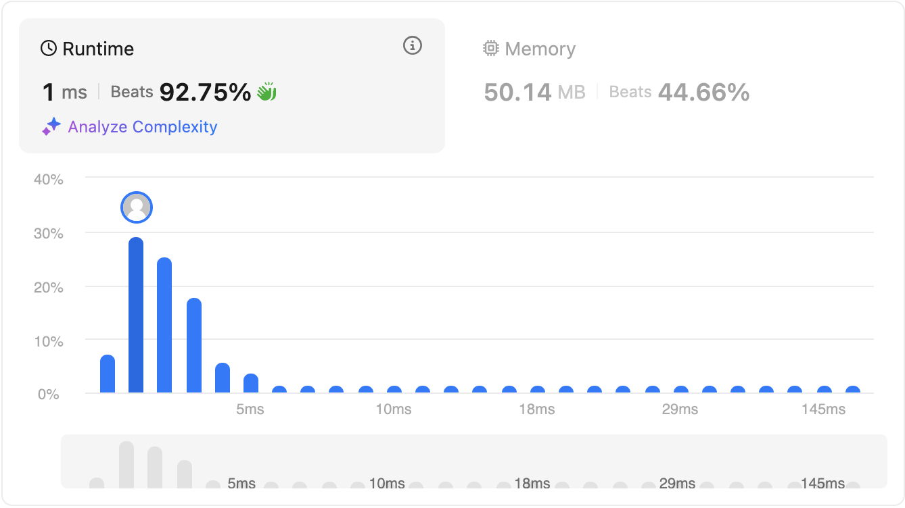

# Two Sum II - Input Array Is Sorted

Given a **1-indexed** array of _integers numbers_ that is already _**sorted in non-decreasing order**_, find two numbers such that they add up to a specific target number. Let these two numbers be `numbers[index1]` and `numbers[index2]` where `1 <= index1 < index2 <= numbers.length`.

Return the indices of the two numbers, `index1` and `index2`, **added by one** as an integer array `[index1, index2]` of length 2.

The tests are generated such that there is **exactly one solution**. You **may not** use the same element twice.

Your solution must use only constant extra space.

 

**Example 1:**

Input: `numbers = [2,7,11,15], target = 9`

Output: `[1,2]`

Explanation: `The sum of 2 and 7 is 9. Therefore, index1 = 1, index2 = 2. We return [1, 2].`

**Example 2:**

Input: `numbers = [2,3,4], target = 6`

Output: `[1,3]`

Explanation: `The sum of 2 and 4 is 6. Therefore index1 = 1, index2 = 3. We return [1, 3].`

**Example 3:**

Input: `numbers = [-1,0], target = -1`

Output: `[1,2]`

Explanation: `The sum of -1 and 0 is -1. Therefore index1 = 1, index2 = 2. We return [1, 2].`

 

**Constraints:**

- 2 <= `numbers.length` <= 3 * 10<sup>4</sup>
- -1000 <= `numbers[i]` <= 1000
- numbers is sorted in non-decreasing order.
- -1000 <= `target` <= 1000
- The tests are generated such that there is exactly one solution.

# Solutions

## Two pointer approach

```javascript
var twoSum = function(numbers, target) {
    let left = 0;
    let right = numbers.length - 1 ;
    while(left < right) {
        const sum = numbers[left] + numbers[right];
        if(sum > target) {
            right--;
        } else if(sum < target) {
            left++;
        } else {
            return [left+1, right+1];
        }
    }
};
```

Time complexity is **O(n)** due to single loop.

Space complexity is **O(1)** as the extra space or variables does not increase with input size.

