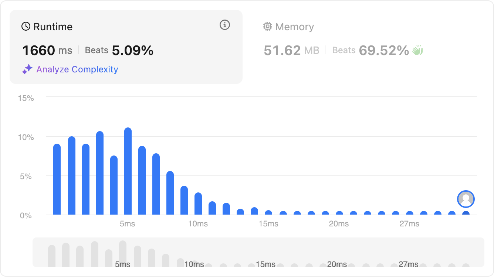
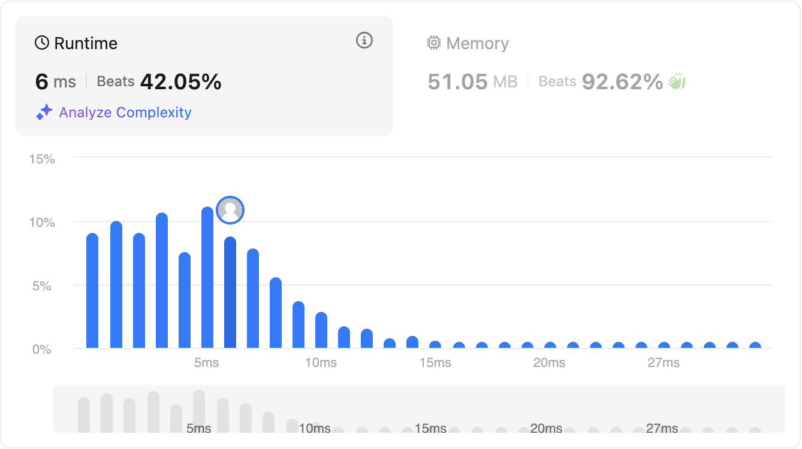
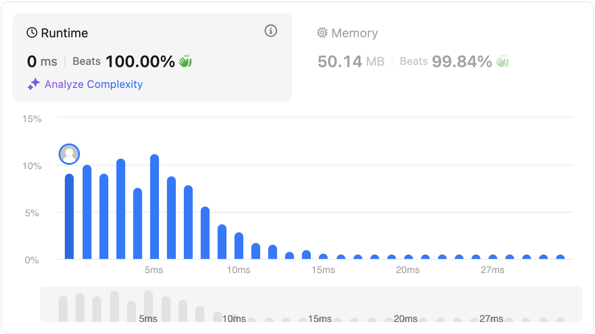

# Majority Element

Given an array `nums` of size `n`, return the _majority element_.

The majority element is the element that appears more than `[n / 2]` times. You may assume that the majority element always exists in the array.

 
**Example 1:**

Input: `nums = [3,2,3]`

Output: `3`

**Example 2:**

Input: `nums = [2,2,1,1,1,2,2]`

Output: `2`

 

**Constraints:**

- `n == nums.length`
- `1 <= n <= 5 * 104`
- `-109 <= nums[i] <= 109`

 
Follow-up: Could you solve the problem in linear time and in O(1) space?

# Solutions

## Brute force

```javascript
var majorityElement = function (nums) {
    // Bruteforce
    for (let i = 0; i < nums.length; i++) {
        let count = 1;
        for(let j = i+1; j < nums.length; j++) {
            if(nums[i] == nums[j]) {
                count++;
            }
        }
        if(count > nums.length / 2) {
            return nums[i];
        }
    }
};
```

Time complexity is **O(n<sup>2</sup>)** as there is one nested loop.

Space complexity is also **O(1)** as the space requirement is constant.




## Using hash table

```javascript
var majorityElement = function (nums) {
    const hashTable = {};
    let count = 1;
    let majority = nums[0];
    for (let i = 0; i < nums.length; i++) {
        if (hashTable[nums[i]]) {
            hashTable[nums[i]]++;
            if (hashTable[nums[i]] > count) {
                count = hashTable[nums[i]];
                majority = nums[i];
            }
        } else {
            hashTable[nums[i]] = 1;
        }
    }
    return majority;
};
```

Time complexity is **O(n)** as there is only one loop.

Space complexity is also **O(n)** as the space requirement increases as the input array size increases.



## Using Moore's voting algorithm

Moore’s Voting Algorithm finds the majority element in a list by maintaining a candidate and a count. It iterates through the list, increasing the count if the current element matches the candidate or decreasing it if it doesn't; when the count reaches zero, it switches the candidate. The final candidate is the majority element, assuming it exists.

```javascript
var majorityElement = function (nums) {
    let majority = nums[0];
    let count = 1;
    for(let i = 0; i < nums.length; i++) {
        if(nums[i] == majority) {
            count++;
        } else {
            count--;
            if(count == 0) {
                majority = nums[i];
                count = 1;
            }
        }
    }
    return majority;
};
```

Time complexity is **O(n)**.

Space complexity is **O(1)**.

