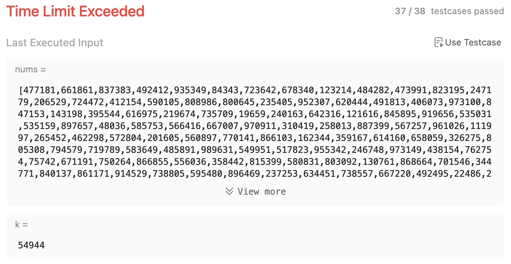

# Rotate Array

Given an integer array `nums`, rotate the array to the right by `k` steps, where `k` is non-negative.

**Example 1:**

Input: `nums = [1,2,3,4,5,6,7], k = 3`

Output: `[5,6,7,1,2,3,4]`

Explanation:
```
rotate 1 steps to the right: [7,1,2,3,4,5,6]
rotate 2 steps to the right: [6,7,1,2,3,4,5]
rotate 3 steps to the right: [5,6,7,1,2,3,4]
```

**Example 2:**

Input: `nums = [-1,-100,3,99], k = 2`

Output: `[3,99,-1,-100]`

Explanation: 
```
rotate 1 steps to the right: [99,-1,-100,3]
rotate 2 steps to the right: [3,99,-1,-100]
```
 
**Constraints:**
- 1 <= `nums.length` <= 10<sup>5</sup>
- -2<sup>31</sup> <= `nums[i]` <= 2<sup>31</sup> - 1
- 0 <= `k` <= 10<sup>5</sup>

**Follow up:**

- Try to come up with as many solutions as you can. There are at least **three** different ways to solve this problem.
- Could you do it in-place with `O(1)` extra space?

# Solutions

## Using builtin Array methods

```javascript
var rotate = function(nums, k) {
    for(let i = 0; i < k; i++) {
        nums.unshift(nums.pop());
    }
};
```

Basic test cases passed. But, could not submit as it failed with large values of `k`.

Time complexity is **O(n<sup>2</sup>)**, as `unshift()` runs in O(n) time.

Space complexity is **O(1)**.



## Using remainder

```javascript
var rotate = function(nums, k) {
    let arrayLength = nums.length;
    k = k % arrayLength;
    const rotated = [];

    for(let i = 0; i < arrayLength; i++) {
        rotated[(i + k) % arrayLength] = nums[i]
    }

    for(let i = 0; i < arrayLength; i++) {
        nums[i] = rotated[i]
    }
};
```

Time complexity is **O(n)**.

Space complexity is **O(n)**.


## Using Array splice

```javascript
function rotate(nums, k) {
    k = k % nums.length
    nums.splice(0, 0, ...nums.splice(nums.length - k, k))
}
```

`k` is set to remainder of `k` and length of `nums`. A length of `nums` simply cycles one full circle.

Time complexity is **O(n)**.

Space complexity is **O(1)** as the operations are done in place on the input array.

